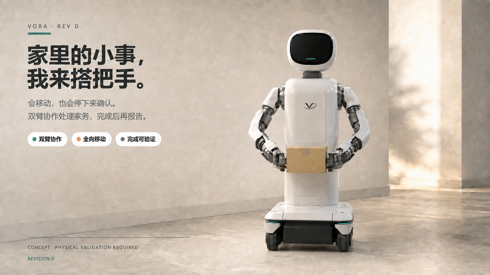

# Workbench Desk Robot

> **Verify before you say done.**
>
> An evidence-first foundation for mobile domestic robots: bounded actions,
> replayable events, and a verifier that can say **confirmed**, **refuted**, or
> **insufficient evidence**.

[](pyproject.toml)
[](LICENSE)
[](https://github.com/Quchaosheng/workbench-desk-robot/releases/latest)
[](https://github.com/Quchaosheng/workbench-desk-robot/actions)



<p align="center"></p>

**Product name:** VORA Home Robot<br>
**Repository/runtime:** Workbench Desk Robot (`workbench-desk-robot`)

VORA is the product brand; Workbench remains the engineering repository and
evidence-first runtime name. The VORA mark uses an open angle and off-axis orbit
to stay distinctive without binding the identity to one robot use case.

[简体中文](README.zh-CN.md) · [Interactive 3D view](docs/assets/premium-product-render.html)

## Why Workbench?

Robot demos often treat “command accepted” as “task complete”. Workbench keeps
the proof in the loop:

```text
goal -> bounded planner -> semantic action -> trusted executor
                                      \-> event store -> verifier -> replay/dashboard
```

| Layer | Responsibility |
| --- | --- |
| Intent | Select from a small, typed action vocabulary |
| Execution | Dispatch through trusted runtime code |
| Verification | Check post-action evidence; never guess success |
| Replay | Rebuild the state from an append-only event stream |

## Quickstart

Requirements: Python 3.12. No GPU is required for the offline runtime.

```bash
git clone https://github.com/Quchaosheng/workbench-desk-robot.git
cd workbench-desk-robot
python -m pip install -e ".[dev]"
python tools/scripts/sim_cli.py doctor
python tools/scripts/sim_cli.py run normal-001 --runner scripted --output-dir runs/demo
```

Run the full portable checks:

```bash
python -m pytest -q
python -m ruff check .
```

The scripted runner writes a replayable artifact (manifest, scene, events,
logs, metadata, and SHA-256 checksums) labelled `SCRIPTED_FIXTURE`.

## What is included

- Evidence-first verification with `confirmed`, `refuted`, and `insufficient_evidence`.
- Strict JSON schemas and matching Pydantic contracts.
- Append-only SQLite event storage with integrity-checked replay.
- Fail-closed policy validation for bounded semantic tools.
- Read-only dashboard and deterministic simulation fixtures.
- Software-only foundations for MCU, CAN, Motion, and BSP boundaries.

## Optional: OmniLink knowledge layer

[OmniLink AI](https://github.com/vivekmaru/omnilink-ai) is an independent service
for searching maintenance notes, ADRs, issues, and Workbench run summaries. It
is not a planner, executor, verifier, or robot-control dependency.

```bash
git clone https://github.com/vivekmaru/omnilink-ai.git
cd omnilink-ai
npm install
npm run dev                 # normally http://127.0.0.1:3000
```

Workbench uses the standard-library adapter in [`integrations/omnilink/`](integrations/omnilink/):

```python
from integrations.omnilink import OmniLinkClient

client = OmniLinkClient("http://127.0.0.1:3000")
results = client.search("gripper calibration")
answer = client.ask("Which calibration notes mention the gripper?")
```

Only bounded run summaries are exportable. Raw JSONL, `TaskGraph`,
`SemanticAction`, action results, camera data, and safety state stay in
Workbench. Catch `OmniLinkError` so an unavailable knowledge service cannot
block offline operation. See the [integration guide](integrations/omnilink/README.md)
for deployment and security requirements.

## Honest status

The offline runtime and software boundaries are tested. End-to-end Gazebo worlds,
real perception, semantic motion execution, and physical hardware evidence are
not yet release claims. See [`docs/architecture/`](docs/architecture/) and
[`sim/README.md`](sim/README.md) for the current evidence boundary.

## Documentation

- [User guide](docs/user-guide/index.md)
- [Product evidence layer](docs/product/README.md)
- [System architecture](docs/architecture/system.md)
- [Simulation boundary](sim/README.md)
- [Motion foundation](robot/control/README.md)
- [Safety MCU](firmware/mcu/README.md)
- [Robot BSP](bsp/README.md)
- [Deployment](docs/deployment/multi-host.md)
- [Security policy](SECURITY.md)

## License

Apache-2.0. See [LICENSE](LICENSE).
