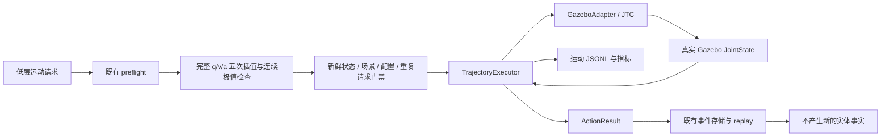

# M1 运动执行阶段报告

> 历史基线报告：下文保留修正前的失败证据。当前停止轨迹语义、运行依赖和最终验收已由 [M1 平滑性修正报告](motion-m1-smoothness.md) 更新；复现当前代码请使用新报告中的时钟 overlay。

日期：2026-09-14。分支：`feat/motion-quintic-point-to-point`，基线 `ee24d61`。本次仅实现已授权的 M1，代码保留在当前工作区，未 commit、push 或进入 M2。

**结论：M1 执行链、拒绝门禁、停止确认和证据重放已实现并通过仿真验证；实际加速度/jerk 平滑性验收未通过。参考多项式满足限值，不代表 Gazebo 实际运动满足同样限值，不能据此宣称真机安全或物理 jerk 受限停止。**

## 1. 当前能力与设计边界

沿用已有六轴 UR5e + Robotiq、quintic 点到点生成器、`AcceptedTrajectory` 和 preflight。新增 ROS 无关的监督执行器；Gazebo、ROS 消息及 action/service 调用集中在传输适配器。底层仍是既有 500 Hz position-command JointTrajectoryController（JTC），Python 不是硬实时伺服环。



- position 请求生成完整 q/v/a 五次参考；trajectory 请求必须是不可变 preflight 结果，并再次验证上下文、内容哈希、连续 q/v/a/jerk 极值。M1 轨迹必须结束于零速度、零加速度。
- 普通请求串行，velocity 模式明确拒绝。重复、过期、初态不连续、碰撞、场景变化或后端未就绪不下发。
- stop/hold 根据测得 q/v 和速度差分估计的加速度生成有界制动参考，再走同一碰撞/限值门禁。终态需要 action 成功、位置收敛和速度不超过 0.01 rad/s 持续至少 0.2 s；取消回执本身不证明停止。
- 反馈丢失、wall watchdog 超时、执行异常及无法完成制动锁定 faulted/unconfirmed。HOLDING/STOPPED 持续检查反馈和位姿漂移。reset 在耗时就绪检查后再次检查新鲜静止状态和旧 goal 终态。
- 晚到的 goal 接受会触发取消；关闭适配器时继续处理接受/结果，最多等待 5 s。完全通信丢失仍不能证明已停，清理失败必须记录 FAIL/unconfirmed。
- 运动日志与指标是研究证据；合法 `action_result` 通过已有 `MotionEvidenceAdapter`、`SQLiteEventStore` 持久化并重新打开验证。运动完成不增加 WorldState 实体事实，也不等于 verified success。

公开 JSON Schema/Pydantic、WorldState、VerificationResult、TaskGraph、事件存储、语义动作和已有 deterministic scenario 未修改。GazeboAdapter 是本阶段执行传输，不是完整的统一 SimulatorBackend；MuJoCo 机器人、RL、遥操作、导纳、动力学辨识和阻抗仍属后续阶段。原未跟踪的 `docs/DEVELOPMENT_ROADMAP.md` 未改动，其中超前描述不能作为已实现证据。

## 2. 修改文件及原因

所有路径均相对仓库根目录；原有三个 Controller 草稿作为本阶段实现纳入工作区。

| 文件 | 用途、接口影响与兼容性 |
|---|---|
| `robot/control/workbench_motion/workbench_motion/motion_types.py` | 保留 RobotState/RobotCommand/ExecutionReceipt 名称，追加可选加速度估计及执行状态/原因；原字段顺序兼容 |
| `robot/control/workbench_motion/workbench_motion/controller.py` | 保留 ROS 无关 Controller port |
| `robot/control/workbench_motion/workbench_motion/reference_controller.py` | 修正既有 effective_limits 元组访问；仍仅为内存准入测试工具，不代表真实执行 |
| `robot/control/workbench_motion/workbench_motion/motion_safety.py` | 完整导数插值、连续极值检查、受限点到点和制动参考；复用现有 preflight |
| `robot/control/workbench_motion/workbench_motion/trajectory_executor.py` | 单一不可变轨迹出口、显式传输时钟、生命周期、双时钟监控、stop/hold/reset 与证据 |
| `robot/control/workbench_motion/workbench_motion/gazebo_adapter.py` | 复用 phase2_probe 的只读 ROS 服务，增加 FJT 传输和真实反馈；不调用原始 execute_arm 绕过门禁 |
| `robot/control/workbench_motion/workbench_motion/motion_metrics.py` | 严格 JSONL、独立连续序号、按试验释放内存、按反馈时间加权 RMS 与导数估计 |
| `robot/control/workbench_motion/workbench_motion/motion_benchmark.py` | seeded 实机引擎仿真试验、显式故障注入、失败持久化、SQLite reopen/replay、实际超限独立报告；启动前检查证据依赖 |
| `robot/control/workbench_motion/config/motion_control.yaml` | 保守仿真参考限值及时间/误差门槛；不是厂家额定或已验证真机参数 |
| `robot/control/workbench_motion/config/motion.rviz` | world 固定坐标系、RobotModel、TF 视图 |
| `robot/control/workbench_motion/launch/sim_control.launch.py` | 同一实例新增可选 `gui`/`rviz` 参数，默认保持 headless |
| `robot/control/workbench_motion/setup.py`、`package.xml` | 安装基准入口、RViz 配置及声明 ROS 运行依赖 |
| `robot/control/workbench_motion/test/test_{controller,motion_safety,trajectory_executor,gazebo_adapter,motion_metrics,motion_benchmark,motion_launch}.py` | 新增数值、安全、生命周期、ROS 边界、异常证据及打包回归测试 |
| `docs/task_packets/motion-m1-closed-loop.json` | 已授权边界、检查命令、证据与停止条件 |
| `docs/plans/2026-09-14-motion-control.md` | 落盘已选定的 M1—M6 路线与 M1 契约 |
| 本报告 | 记录真实结果、复现方式、未通过项目与下一步 |

未更改 Docker 镜像依赖清单；RViz 已在原镜像内。未改 Compose、硬件参数、firmware、公共 contracts 或事件语义。

## 3. 实际运行环境

- 原项目镜像 `workbench-1:local`，不可变 Image ID：`sha256:4afb873e5cc6d466c6d0bda73db2455d977da52219839ad74eff442a7f9e5e0e`。镜像早于本分支，不能把预装模块当作本次源码。
- ROS 2 Jazzy、Gazebo Harmonic；现场 JTC 4.40.1、controller_manager 4.45.2、gz_ros2_control 1.2.19。
- 实际 controller 参数：position 命令、position/velocity 状态、`splines`、`interpolate_from_desired_state=false`、`allow_partial_joints_goal=false`。
- 当前源代码 colcon overlay：容器 `/workspace/log/m1-install`，构建目录 `/workspace/log/m1-build`。最终报告内所有已加载 motion 模块的 SHA256 与最终仓库源码逐项一致。
- GUI 容器 `workbench-m1-final-20260914`：Gazebo server、Gazebo GUI、RViz2 来自新增 launch；ROS domain 43、独立 Gazebo partition，避免与原实例互扰。
- NVIDIA RTX 4060 Laptop，driver 570.195.03；OGRE 明确报告 NVIDIA GL_RENDERER，doctor PASS。枚举另一 `/dev/dri/card1` 的 EGL warning 仍存在，未隐去。

环境排障没有修改仓库：临时 Compose override `/tmp/workbench-m1-runtime-override.yaml` 显式启用 NVIDIA runtime、graphics/display capability，以及匹配 GUI UID 的 HOME tmpfs。初次缺 EGL 注入、HOME/构建卷权限、`/tmp` noexec/容量以及旧 Python 包的问题，均保留为环境问题；最终验证使用卷所属 UID 写独立目录，并将当前项目 Python 包安装到隔离 target。

## 4. 真实 Gazebo 结果

最终 run：`m1-final-verified`。共 **49 个试验**：31 次正常执行（含零位移和24次回位）、6 次运动中 stop、6 次运动中 hold、6 次反馈屏蔽故障注入；每个 seed 0/7/42 重复两轮。全部通过**执行生命周期和拒绝门禁**。49 次重复请求全部零额外下发；另有 velocity、越限、过期命令各一次真实传输端零下发检查。

故障注入仅屏蔽控制器观察，Gazebo 物理引擎继续真实运行。只有注入后同一请求出现 stale_state 故障且后续实际静止、reset 被准入才算该故障试验通过；其他故障不能冒充反馈丢失测试成功。碰撞、未知接受等额外失败分支由明确标记的端口测试替身覆盖，不称为真实物理验证。

| 指标 | 最终观测 |
|---|---:|
| 最大单关节 RMS 位置误差（全部分段） | 0.00121137 rad |
| 最大绝对位置误差 | 0.00275088 rad |
| 指标所用不同时间戳反馈采样率 | 497.006—500.000 Hz |
| 仿真时间 / 实际运行时间 | 0.97281—1.05423 |
| SQLite 重新打开后事件数 | 49 |
| 新增实体位置事实 | 0 |
| verified success | 未判定；缺少独立 WorldState 观察 |

同 seed 的普通肩关节运动 RMS 误差：

| seed | 第1轮 rad | 第2轮 rad |
|---|---:|---:|
| 0 | 0.0010329124 | 0.0009857143 |
| 7 | 0.0010542065 | 0.0010541721 |
| 42 | 0.0007121067 | 0.0007113144 |

seed 控制目标生成；没有声称控制 ROS 调度、物理引擎噪声或逐 bit 复现。每次通过相同门禁回到初始观察位置，未在轮次间 reset 物理世界。

### 未通过：实际导数限值

参考限值为每轴速度 0.2 rad/s、加速度 0.5 rad/s²、jerk 2 rad/s³。**61 个有指标的轨迹分段中，59 个分段的测量导数至少一项超过参考限值。**

| 试验类别 | 最大估计加速度 rad/s² | 最大估计 jerk rad/s³ |
|---|---:|---:|
| nominal（含回位） | 2.53393 | 2212.46554 |
| stop | 109.14018 | 59872.65992 |
| hold | 109.48022 | 73096.91262 |
| feedback_loss（故障前可用采样） | 2.07922 | 1246.41444 |

这些数值来自真实速度反馈的有限差分，不是参考多项式导数。采样离散性、position 插件的跟踪修正、目标替换及参考起点时刻偏差都需要进一步区分；本次未定位根因，不把超限解释为已证实的“纯噪声”。`summary.json` 的 `status_scope` 明确限定执行 PASS，另行记录 `measured_derivative_bounds=exceeded` 和 `continuous_physical_bound_proven=false`。

因此本阶段证明的是执行/反馈/证据链，不是全量动力学限值通过。尤其不能把停止后的静止确认解释为整个制动过程物理 jerk 受限。

## 5. 测试与审查

| 检查 | 结果与范围 |
|---|---|
| `make test` | 当前项目源码隔离安装：1175 passed，363 subtests passed，2 skipped；没有排除整个 multi_host_deployment 文件 |
| 运动包 `python3 -m pytest -q` | 项目容器 Python + Jazzy 资源：348 passed，无跳过 |
| colcon build/test/test-result | 构建成功；348 tests，0 errors，0 failures，1 skipped。colcon 的系统 Python 缺项目契约包，跳过的持久化用例已在上一行完整运行 |
| `make contract` | PASS，JSON Schema / Pydantic 双向序列化及模板 planner 检查 |
| `make scenario-check` | PASS，12 frozen + 24 expanded，same-seed materialization deterministic |
| `make context-check` / Task Packet | PASS |
| `ruff check .` / `ruff format --check .` | PASS |
| `git diff --check` | PASS |
| 六个审查视角及独立 findings 验证 | ce-code-review 完成，未保留 actionable findings；审查不替代运行验证 |

全仓两项跳过为既有 Issue 66/71 Controller Compose runtime smoke，缺相应镜像/运行环境；Compose 配置测试通过。初次全仓测试用到旧预装包，后续使用当前源码隔离 wheel 消除该问题；缺 Docker CLI 的配置测试也在加入临时 CLI 后全部重跑通过。

补充覆盖：连续插值内部超限、末端非静止、过期命令在耗时检查后拒绝、反馈缺失/暂停/时钟倒退、journal 写失败、停止后漂移、reset 期间状态变化、晚到接受/取消未确认、ROS NOT_SET 参数、action 错误码、场景哈希、碰撞采样预算及失败试验的 ActionResult 持久化。

简化阶段采用两项改进：去掉无行为的状态序列化包装；指标完成后释放本轮内存但保留文件连续序号。保留同步场景检查，未用缓存削弱新鲜性门禁；已有 probe 私有 future-wait 复用未进行跨模块重构。长期运行的 goal 历史对象回收、场景服务性能优化留待明确后续范围。

## 6. 复现命令

在支持 NVIDIA/X11 的项目容器中，先 source Jazzy，再 source 当前源码 overlay。标准构建入口仍可用：

```bash
make container-colcon-build
make container-colcon-test
```

本次因共享卷 UID 不同，改为卷所属 UID 在**独立子目录**构建（路径可按环境替换）：

```bash
source /opt/ros/jazzy/setup.bash
colcon --log-base /workspace/log/m1-colcon-log build \
  --base-paths /workspace/src/robot/control \
  --build-base /workspace/log/m1-build \
  --install-base /workspace/log/m1-install \
  --merge-install --packages-select workbench_motion
source /workspace/log/m1-install/setup.bash
ros2 launch workbench_motion sim_control.launch.py gui:=true rviz:=true
```

在同一容器另一个终端，使用**项目 Python**，不要仅依赖 colcon console script 的系统 Python shebang：

```bash
source /opt/ros/jazzy/setup.bash
source /workspace/log/m1-install/setup.bash
python3 -c 'import workbench_contracts, workbench_world_model'
ros2 run --prefix python3 workbench_motion motion_benchmark \
  --output /tmp/my-motion-run \
  --seeds 0 7 42 --repeats 2 \
  --image-id '<docker inspect 获得的不可变 Image ID>' \
  --source-revision '<Git SHA 及 dirty 状态>'
```

也可使用 `python3 -m workbench_motion.motion_benchmark`。本次最终运行额外使用 `PYTHONPATH=/workspace/log/m1-python:$PYTHONPATH`，指向由**当前项目源码**安装的隔离 Python target。缺证据依赖时现在会在创建 ROS 客户端和动作之前报错。输出目录必须不存在，避免覆盖旧证据。

基准参数：`--modes nominal stop hold feedback_loss` 选择试验，`--seeds` 控制目标，`--repeats` 为每 seed 的重复数，`--output` 存放 JSONL/summary/SQLite；镜像与 revision 是操作者提供标签，同时记录实际加载模块、配置、robot_description 的哈希。

运行测试：

```bash
# 项目 Python 环境；根目录
make test
make contract
make scenario-check
make context-check
make task-check PACKET=docs/task_packets/motion-m1-closed-loop.json

# 已 source Jazzy 及 overlay；robot/control 目录
PYTEST_DISABLE_PLUGIN_AUTOLOAD=1 python3 -m pytest -q
```

单独 host `uv run --offline --directory robot/control pytest` 环境不含 UR 描述资源和项目契约包，不能代替完整容器检查。本次 host 快速测试与最终容器测试分开记录。

## 7. 证据位置与运行观察

原始运行数据未进入 Git，保存在本机会话：

- `/tmp/workbench-m1-final-evidence.tar`：最终49次试验的 summary/JSONL/SQLite、新 launch 日志、OGRE 日志，及系统 Python 入口失败记录。
- `/tmp/workbench-m1-test-evidence.tar`：全仓/运动包测试及 colcon 日志。
- `/tmp/workbench-m1-evidence.tar`：较早源码版本的48次试验，仅为开发过程证据，不冒充最终源码运行。
- `/tmp/compound-engineering-1000/ce-code-review/20260914-m1-final-f3c5c55a`：正式审查 receipt 与各视角/validator 记录。
- 最终容器 `/tmp/m1-final-verified/summary.json`、`motion.jsonl`、`events.sqlite`；`/tmp/m1-final-doctor.json` 为已 source 环境的 PASS。

这些是临时本地证据，需要长期保留时应转存到受控实验存储，而不是提交原始数据进仓库。观测时检查 `fault`、`rejected`、`completed`、`cleanup_error`、`measured_derivative_bounds`；运行期间持续处理反馈。未知接受、反馈中断或跟踪错误应终止当前试验并保持 unconfirmed；不能仅通过 reset 清除失败证据。监督进程若被强制杀死或完全断链，当前 position JTC 不能提供独立的安全级看门狗。

## 8. 下一阶段建议

**先关闭 M1 的实际平滑性缺口，再授权 M2。** 建议下一次只做一个有明确指标的小阶段：对齐 action-server 实际起始时间、测量目标替换前后 q/v/a 的连续性，将制动接管误差与反馈差分误差分开；保持现有限值，禁止通过提高阈值“消除”超限。若需要改变 JTC 插值初态策略或底层控制模式，应先提出最小兼容方案并确认。

平滑性验收完成后，按已选路线推进 M2 键盘笛卡尔 jog（IK → joint target → trajectory → controller）；再做 M3 力观测/导纳、M4 名义动力学/重力补偿、M5 辨识/碰撞残差、M6 阻抗。不能把现阶段 sampled-path 碰撞检查当作接触检测，也不能把当前 position 模式用作扭矩控制或阻抗实验。
