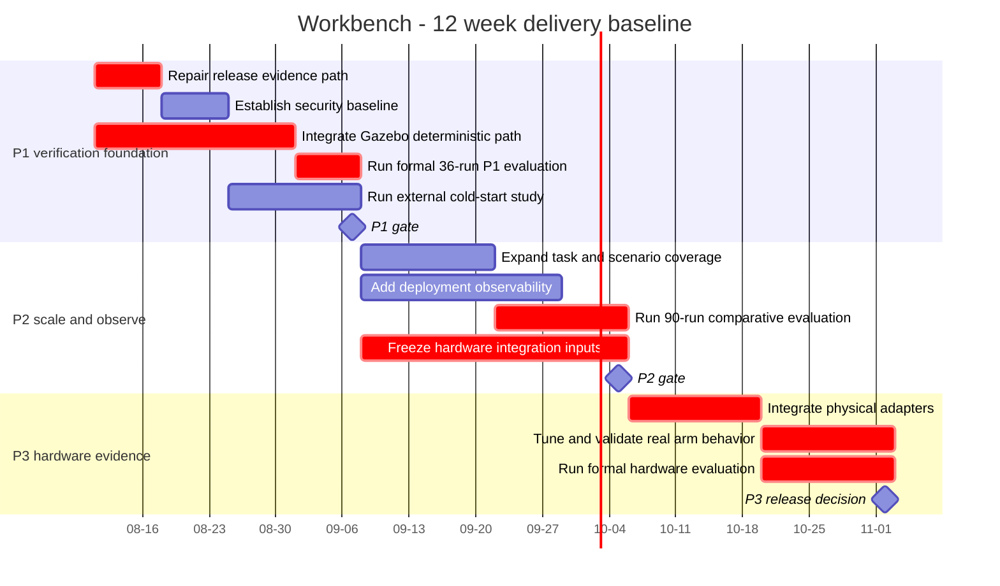

# Project plan

Baseline date: 2026-08-11. The schedule is a planning baseline, not proof that a task has started or completed.

The P2/P3 rows below predate the re-scoped product baseline in
[ADR-0007](../decisions/ADR-0007-household-mvp-baseline.md) (Issue #166), which
fixes the household MVP as a single-arm mobile system and puts dual-arm
coordination out of scope. The dates, gates and `NOT_READY` states are unchanged.
This table remains the historical planning baseline, and it is not evidence that
a dual-arm mobile product is in scope.

## Milestones and gates

| Gate | Planned date | Entry dependency | Exit criteria | Current state |
|---|---|---|---|---|
| P1 | 2026-09-07 | integrated deterministic Gazebo path | false completion 0, collision 0, grasp >=90%, VTCR >=80%, 36 formal runs, external reproduction >=2/3 | NOT_READY |
| P2 | 2026-10-05 | P1 gate plus expanded task/scenario set | >=3 task types, 30 scenarios, 90 formal runs, P95 <60s, hardware inputs frozen | NOT_READY |
| P3 | 2026-11-02 | physical adapters and independent emergency stop | real false completion 0, collision 0, grasp >=70%, >=30 real runs, contract changes 0 | NOT_READY |

## Critical dependencies

| Dependency | Consumer | Control |
|---|---|---|
| Simulation world and arm composition | formal P1 evaluation | require a reproducible launch command and raw Gazebo logs before scheduling the gate review |
| Frozen schemas and matching Pydantic models | all producers and consumers | three-owner approval plus `make contract` in the same PR |
| Dated quotes, approved AVL, and incoming inspection | hardware order and P3 | keep order release blocked until external records exist |
| External participant records | reproducibility claim | retain all failures and validate unique participants |
| Human-owned release/tag decision | publication | AI and CI prepare evidence but never create the decision |

Schedule variance is measured against this baseline at every weekly review. Missing evidence changes the gate state, not the historical baseline.
